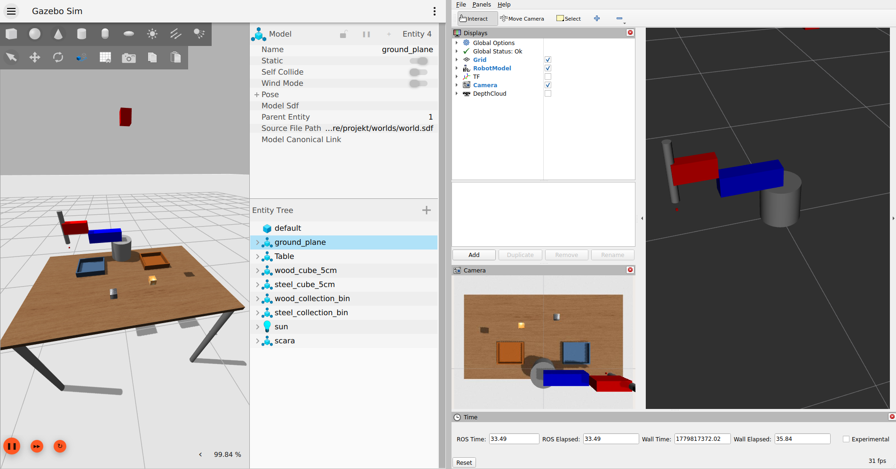
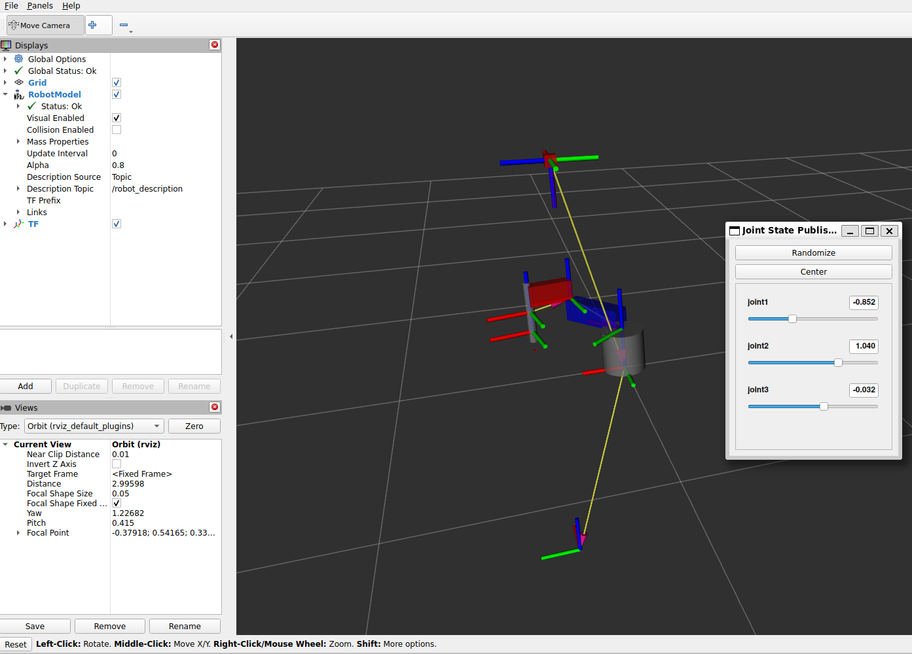
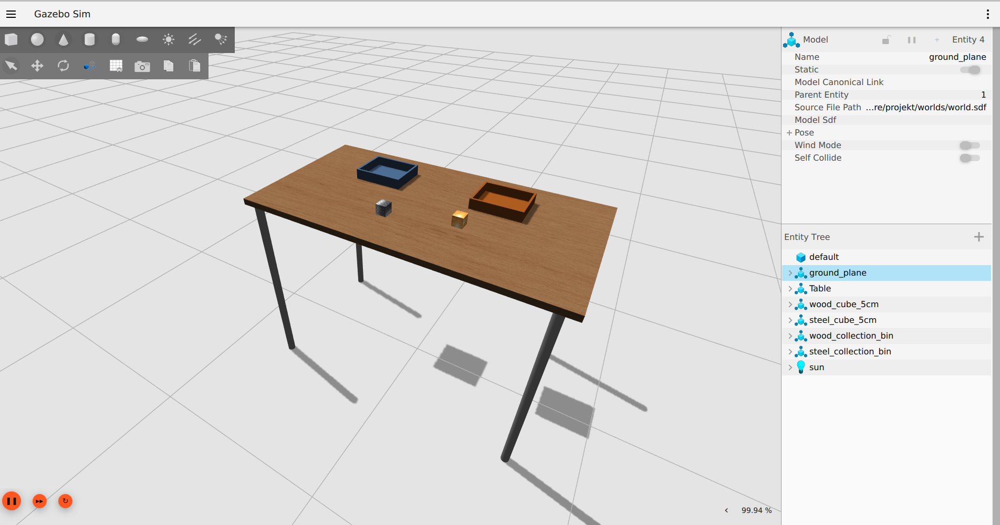
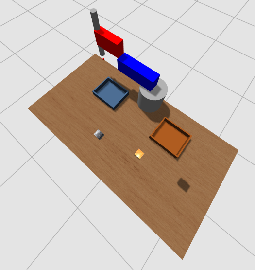
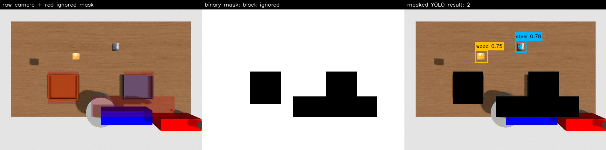
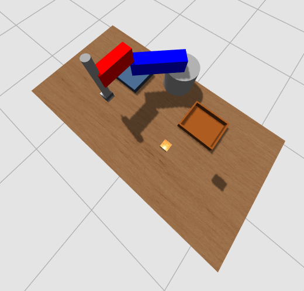
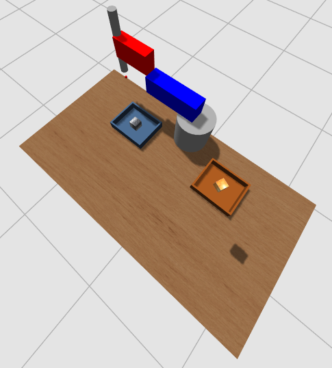
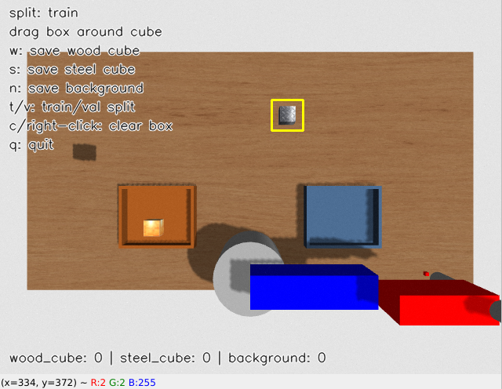
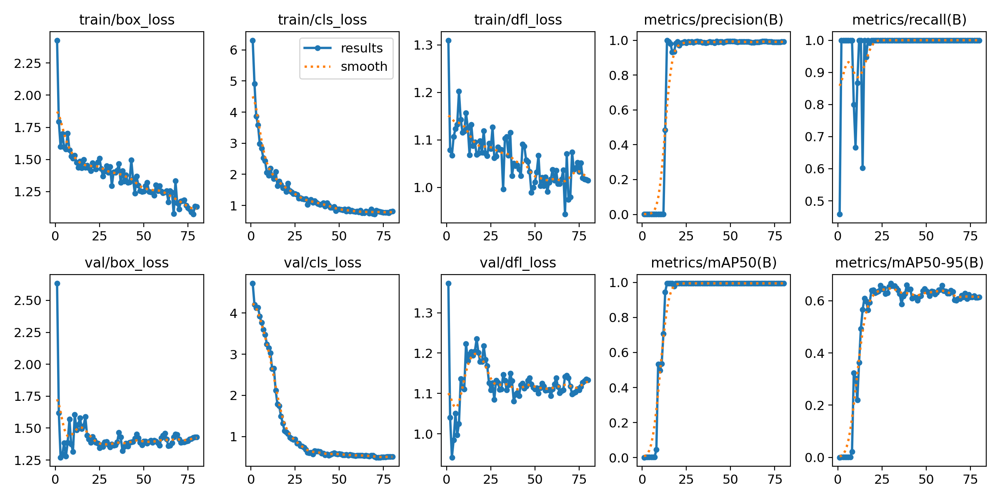

# SCARA_projekt

> Presentation video: [insert the YouTube link here](https://www.youtube.com/)

This repository contains a ROS 2 and Gazebo Sim project for a small SCARA sorting robot. The robot detects a wood cube and a steel cube from a fixed top-down table camera, converts the detected image pixels into robot-base `x` and `y` coordinates, and sorts the cubes into their matching bins.

The project was made for the **MOGI Robotrendszerek laboratórium** and **Kognitív robotika** subjects by **Csongor Telegdi** and **Zsombor Veszprémi**.



The meshes for the cubes and collection bins were modelled in Blender and are used by Gazebo through the model files in [`projekt/meshes`](projekt/meshes).

## Contents

- [Assumptions](#assumptions)
- [Repository Layout](#repository-layout)
- [Quick Start With The Pretrained Detector](#quick-start-with-the-pretrained-detector)
- [Install Dependencies](#install-dependencies)
- [Run Checks And Retesting](#run-checks-and-retesting)
- [Launch Files](#launch-files)
- [World Content](#world-content)
- [Robot URDF](#robot-urdf)
- [Sorting Pipeline](#sorting-pipeline)
- [YOLO Cube Detector](#yolo-cube-detector)
- [Image Processing And Mask Logic](#image-processing-and-mask-logic)
- [Pixel To Robot Coordinates](#pixel-to-robot-coordinates)
- [Inverse Kinematics](#inverse-kinematics)
- [Pick And Place Logic](#pick-and-place-logic)
- [Safety And Security Steps](#safety-and-security-steps)
- [Attach And Detach Controller](#attach-and-detach-controller)
- [Training Images](#training-images)
- [Training YOLO](#training-yolo)
- [Common Problems](#common-problems)
- [Development Notes](#development-notes)
- [Figure Files](#figure-files)

## Assumptions

This README assumes you already have a Linux system with ROS 2 installed. The project has been developed for **ROS 2 Jazzy on Ubuntu 24.04 with Gazebo Harmonic**. If you use another ROS 2 distribution, replace `jazzy` in the package names and check the matching Gazebo version. The URDF currently references the Jazzy `gz_ros2_control` plugin path, so Jazzy is the expected setup.

Official installation and reference pages used by this guide:

- [ROS 2 Jazzy Ubuntu installation](https://docs.ros.org/en/jazzy/Installation/Ubuntu-Install-Debs.html)
- [Using colcon to build ROS 2 packages](https://docs.ros.org/en/jazzy/Tutorials/Beginner-Client-Libraries/Colcon-Tutorial.html)
- [Gazebo Harmonic binary installation](https://gazebosim.org/docs/harmonic/install_ubuntu/)
- [Gazebo and ROS 2 integration](https://gazebosim.org/docs/harmonic/ros2_integration/)
- [RViz user guide](https://docs.ros.org/en/ros2_packages/jazzy/api/rviz2/doc/index.html)
- [Python virtual environments](https://docs.python.org/3/library/venv.html)
- [Ultralytics quickstart](https://docs.ultralytics.com/quickstart/)
- [Ultralytics detection datasets](https://docs.ultralytics.com/datasets/detect/)
- [Ultralytics training mode](https://docs.ultralytics.com/modes/train/)
- [Ultralytics export mode](https://docs.ultralytics.com/modes/export/)

ROS package links in the sections below point to their ROS Index pages.

## Repository Layout

```text
SCARA_projekt/
├── docs/
│   └── images/                 # README screenshots and detector debug image
├── README.md
└── projekt/
    ├── config/                 # ros2_control and Gazebo bridge configuration
    ├── datasets/scara_cubes/   # YOLO-format cube dataset
    ├── launch/                 # check_urdf, world, spawn_robot, start_sorting
    ├── meshes/                 # Blender-made cube/bin Gazebo models
    ├── msg/                    # PixelDetection custom ROS messages
    ├── runs/                   # YOLO training outputs and exported detector
    ├── rviz/                   # RViz configs
    ├── scripts/                # sorting, detector, attach-detach, image tools
    ├── training_images/        # source class-folder images for annotation
    ├── urdf/scara.urdf         # robot, camera, sensors, ros2_control plugins
    ├── worlds/world.sdf        # table, cubes, bins, lights, physics
    ├── yolo26n.pt              # optional pretrained starting model
    └── yolov8n.pt              # pretrained starting model used for training
```

The default trained detector used by the sorting launch is:

```text
projekt/runs/detect/train-3/weights/best.onnx
```

## Quick Start With The Pretrained Detector

Use this path if you only want to run the sorting demo with the pretrained neural network already included in the repository and you do not want to train a new model.

Install dependencies, clone, build, and source the workspace as described in [Install Dependencies](#install-dependencies). Then open two terminals.

Terminal 1 starts Gazebo, RViz, the robot, the controllers, and the camera bridge:

```bash
source /opt/ros/jazzy/setup.bash
cd ~/projekt_ws/SCARA_projekt
source .venv/bin/activate
source install/setup.bash
ros2 launch projekt spawn_robot.launch.py
```

Wait until Gazebo is open and the robot has moved to its home position. Terminal 2 starts sorting with the included ONNX model:

```bash
source /opt/ros/jazzy/setup.bash
cd ~/projekt_ws/SCARA_projekt
source .venv/bin/activate
source install/setup.bash
ros2 launch projekt start_sorting.launch.py
```

`start_sorting.launch.py` uses `projekt/runs/detect/train-3/weights/best.onnx` by default, so no `detector_model` argument is needed for the pretrained repo model. If you want to be explicit, run:

```bash
ros2 launch projekt start_sorting.launch.py \
  detector_model:="$PWD/projekt/runs/detect/train-3/weights/best.onnx" \
  detector_backend:=onnxruntime
```

The detector will take one masked table-camera snapshot while the robot is home, publish the detected wood and steel cube pixels, and the sorter will move each reachable cube to its matching bin. To test another arrangement, stop only the sorting launch with `Ctrl+C`, move the cubes in Gazebo, and run `ros2 launch projekt start_sorting.launch.py` again.

If the large Gazebo model pack is not already present after cloning, download it here:

[Gazebo models on Google Drive](https://drive.google.com/file/d/1tcfoLFReEW1XNHPUAeLpIz2iZXqQBvo_/view)

Extract or copy the model folders into `~/gazebo_models`. The launch files add this directory to `GZ_SIM_RESOURCE_PATH` automatically.

## Install Dependencies

Start from a terminal with ROS 2 Jazzy available:

```bash
source /opt/ros/jazzy/setup.bash
```

Install the ROS, Gazebo, RViz, build, and Python packages used by the project:

```bash
sudo apt update
sudo apt install -y \
  git curl lsb-release gnupg unzip \
  python3-pip python3-venv python3-colcon-common-extensions python3-rosdep \
  python3-numpy python3-opencv python3-pyqt5 python3-pyqt5.qtsvg \
  ros-jazzy-ament-cmake \
  ros-jazzy-ament-index-python \
  ros-jazzy-control-msgs \
  ros-jazzy-controller-manager \
  ros-jazzy-cv-bridge \
  ros-jazzy-gz-ros2-control \
  ros-jazzy-joint-state-broadcaster \
  ros-jazzy-joint-state-publisher \
  ros-jazzy-joint-state-publisher-gui \
  ros-jazzy-joint-trajectory-controller \
  ros-jazzy-launch \
  ros-jazzy-launch-ros \
  ros-jazzy-rclpy \
  ros-jazzy-robot-state-publisher \
  ros-jazzy-ros-gz \
  ros-jazzy-ros-gz-bridge \
  ros-jazzy-ros-gz-image \
  ros-jazzy-ros-gz-interfaces \
  ros-jazzy-ros-gz-sim \
  ros-jazzy-rosgraph-msgs \
  ros-jazzy-rosidl-default-generators \
  ros-jazzy-rosidl-default-runtime \
  ros-jazzy-ros2-control \
  ros-jazzy-ros2-controllers \
  ros-jazzy-rqt-image-view \
  ros-jazzy-rviz2 \
  ros-jazzy-sensor-msgs \
  ros-jazzy-std-msgs \
  ros-jazzy-tf2-ros \
  ros-jazzy-topic-tools \
  ros-jazzy-trajectory-msgs \
  ros-jazzy-urdf-launch \
  ros-jazzy-xacro
```

If `gz sim --version` does not work after installing the ROS Gazebo packages, install Gazebo Harmonic from the official Gazebo repository:

```bash
sudo apt-get update
sudo apt-get install -y curl lsb-release gnupg
sudo curl https://packages.osrfoundation.org/gazebo.gpg --output /usr/share/keyrings/pkgs-osrf-archive-keyring.gpg
echo "deb [arch=$(dpkg --print-architecture) signed-by=/usr/share/keyrings/pkgs-osrf-archive-keyring.gpg] https://packages.osrfoundation.org/gazebo/ubuntu-stable $(lsb_release -cs) main" | sudo tee /etc/apt/sources.list.d/gazebo-stable.list > /dev/null
sudo apt-get update
sudo apt-get install -y gz-harmonic
```

If this is the first time `rosdep` is used on the machine, initialize it once:

```bash
sudo rosdep init
rosdep update
```

Clone the repository:

```bash
mkdir -p ~/projekt_ws
cd ~/projekt_ws
git clone https://github.com/telegdicsongor/SCARA_projekt.git SCARA_projekt
cd SCARA_projekt
```

Install any dependency that is declared in [`projekt/package.xml`](projekt/package.xml) and not already installed:

```bash
rosdep install --from-paths projekt --ignore-src -r -y
```

The ROS package is built with [`ament_cmake`](https://index.ros.org/p/ament_cmake/) and installed resources are found at runtime with [`ament_index_python`](https://index.ros.org/p/ament_index_python/).

Create the Python virtual environment used by YOLO training, YOLO export, and ONNX Runtime inference. The project uses `--system-site-packages` because ROS 2 Python packages such as `rclpy`, `cv_bridge`, and generated message modules are installed by apt under `/opt/ros/jazzy`:

```bash
source /opt/ros/jazzy/setup.bash
cd ~/projekt_ws/SCARA_projekt
python3 -m venv --system-site-packages .venv
source .venv/bin/activate
python -m pip install --upgrade pip
python -m pip install ultralytics onnx onnxruntime
```

Check that the environment can see both the ROS Python packages and the ML packages:

```bash
python -c "import rclpy, cv2, onnxruntime; from ultralytics import YOLO; print('virtual environment OK')"
```

If that command fails because `rclpy` or `cv_bridge` is missing, recreate the environment with `--system-site-packages`. If it fails because `onnxruntime` or `ultralytics` is missing, activate `.venv` again and rerun the `pip install` command.

Build the ROS 2 package:

```bash
source /opt/ros/jazzy/setup.bash
cd ~/projekt_ws/SCARA_projekt
colcon build --symlink-install --packages-select projekt
source install/setup.bash
```

For every new terminal that runs the detector, sorter, training, or export commands, source ROS, activate `.venv`, and source the built workspace:

```bash
source /opt/ros/jazzy/setup.bash
cd ~/projekt_ws/SCARA_projekt
source .venv/bin/activate
source install/setup.bash
```

For GUI-only tools such as `rqt_image_view`, use a separate terminal without `.venv` if Qt bindings are not visible:

```bash
deactivate  # only if .venv is active
source /opt/ros/jazzy/setup.bash
cd ~/projekt_ws/SCARA_projekt
source install/setup.bash
```

## Run Checks And Retesting

After the two quick-start launch commands are running, the detector reads `/table_camera/image/compressed`, publishes one home-position detection snapshot to `/sorting/pixel_detections`, and the sorter moves every reachable cube to its bin. If a detected cube is outside the SCARA workspace, the sorter prints a warning and tries the next reachable detection. If no reachable cube remains, it returns to home.

Useful checks:

```bash
ros2 topic list
ros2 topic hz /table_camera/image
ros2 topic echo /table_camera/camera_info --once
ros2 topic echo /sorting/pixel_detections --once
ros2 action list
```

To test whether image detection works repeatedly, keep `spawn_robot.launch.py` running in the first terminal. After the sorting motion sequence finishes and the robot returns home, stop only the sorting launch in the second terminal with `Ctrl+C`. In Gazebo, move the wood and/or steel cube to new positions on the table, outside the masked bin areas and inside the robot workspace. Then start the sorting launch again:

```bash
ros2 launch projekt start_sorting.launch.py
```

This restarts `yolo_cube_detector.py`, takes a new home-position camera snapshot, publishes new pixel detections, and lets `scara_sorter.py` run another sorting sequence without respawning the robot or restarting Gazebo.

## Launch Files

The launch files are ROS 2 Python launch descriptions built with [`launch`](https://index.ros.org/p/launch/) and [`launch_ros`](https://index.ros.org/p/launch_ros/).

`check_urdf.launch.py`

```bash
ros2 launch projekt check_urdf.launch.py
```

This launch file uses the standard [`urdf_launch`](https://index.ros.org/p/urdf_launch/) `display.launch.py` helper. It loads [`projekt/urdf/scara.urdf`](projekt/urdf/scara.urdf), starts [`robot_state_publisher`](https://index.ros.org/p/robot_state_publisher/), starts [`joint_state_publisher_gui`](https://index.ros.org/p/joint_state_publisher_gui/) by default, and opens [`rviz2`](https://index.ros.org/p/rviz2/) with [`projekt/rviz/urdf.rviz`](projekt/rviz/urdf.rviz). The GUI sliders let you move `joint1`, `joint2`, and `joint3` without Gazebo, which is useful for checking the URDF frames, joint limits, TF tree, link origins, and visual/collision geometry.



Optional arguments:

```bash
ros2 launch projekt check_urdf.launch.py gui:=false
ros2 launch projekt check_urdf.launch.py model:=scara.urdf
```

`world.launch.py`

```bash
ros2 launch projekt world.launch.py
```

This starts Gazebo Sim with [`projekt/worlds/world.sdf`](projekt/worlds/world.sdf). It sets `GZ_SIM_RESOURCE_PATH` to include:

- `projekt/meshes`
- the installed package parent directory
- `~/gazebo_models`

The world launch then includes [`ros_gz_sim`](https://index.ros.org/p/ros_gz_sim/) `gz_sim.launch.py` with render settings for Gazebo Sim.



`spawn_robot.launch.py`

```bash
ros2 launch projekt spawn_robot.launch.py
```

This is the main simulation launch. It includes `world.launch.py`, expands the URDF with [`xacro`](https://index.ros.org/p/xacro/), publishes `/robot_description`, spawns the robot in Gazebo through `ros_gz_sim create`, starts the Gazebo to ROS bridge, starts RViz, starts the table camera image bridge, and starts the arm controllers.

The most important nodes are:

- `robot_state_publisher`: publishes the robot TF tree from the URDF and joint states.
- `ros_gz_sim create`: inserts the SCARA robot into the Gazebo world from `/robot_description`.
- [`ros_gz_bridge`](https://index.ros.org/p/ros_gz_bridge/) `parameter_bridge`: bridges clock with [`rosgraph_msgs`](https://index.ros.org/p/rosgraph_msgs/), contact through Gazebo message types, detachable-joint commands, and camera-info topics from [`projekt/config/gz_bridge.yaml`](projekt/config/gz_bridge.yaml).
- [`ros_gz_image`](https://index.ros.org/p/ros_gz_image/) `image_bridge`: bridges the Gazebo table camera image into ROS.
- [`controller_manager`](https://index.ros.org/p/controller_manager/) `spawner`: starts [`joint_state_broadcaster`](https://index.ros.org/p/joint_state_broadcaster/) and [`joint_trajectory_controller`](https://index.ros.org/p/joint_trajectory_controller/).
- [`topic_tools`](https://index.ros.org/p/topic_tools/) `relay`: republishes table camera info for tools that expect it beside the image topic.
- `controller_state_to_joint_states.py`: fallback joint-state relay if the broadcaster package is missing.
- `attach_detach_controller.py`: starts after spawn so the cubes begin detached.


Useful options:

```bash
ros2 launch projekt spawn_robot.launch.py rviz:=false
ros2 launch projekt spawn_robot.launch.py x:=0.0 y:=-0.3 z:=1.02 yaw:=1.5708
ros2 launch projekt spawn_robot.launch.py fake_joint_states:=true
```

`fake_joint_states:=true` starts [`joint_state_publisher`](https://index.ros.org/p/joint_state_publisher/) for URDF-only debugging.

There is also a legacy static sorting mode:

```bash
ros2 launch projekt spawn_robot.launch.py sorting:=true static_pixel_detections:=true
```

That mode publishes demo detections from `world.sdf`. For the neural-network task, use `spawn_robot.launch.py` first and then `start_sorting.launch.py`.

`start_sorting.launch.py`

```bash
ros2 launch projekt start_sorting.launch.py
```

This launch assumes Gazebo, the robot, controllers, TF, and the camera bridge are already running. It starts:

- `attach_detach_controller.py`
- `yolo_cube_detector.py`
- `scara_sorter.py`

By default, it does not use cube poses from `world.sdf` for picking. Instead, `yolo_cube_detector.py` detects the cubes in the compressed table-camera stream and publishes pixel detections. The sorter then projects the pixel centers onto the known cube-top plane and uses the resulting base-frame coordinates for the motion sequence.

The sorting order is confidence-based, not hard-coded by material. If both the wood cube and the steel cube are detected, `scara_sorter.py` first tries the reachable detection with the highest YOLO confidence. After that cube is completed or skipped, it tries the next reachable unfinished detection from the same home-position snapshot.

Default detector model:

```text
projekt/runs/detect/train-3/weights/best.onnx
```

Equivalent launch argument:

```bash
ros2 launch projekt start_sorting.launch.py \
  detector_model:="$PWD/projekt/runs/detect/train-3/weights/best.onnx"
```

Other useful arguments:

```bash
ros2 launch projekt start_sorting.launch.py detector_confidence:=0.45
ros2 launch projekt start_sorting.launch.py detector_backend:=onnxruntime
ros2 launch projekt start_sorting.launch.py detector_publish_once:=false
ros2 launch projekt start_sorting.launch.py static_pixel_detections:=true
```

The default launch masks the robot home area and the two bin areas with `mask_base_rectangles`. These rectangles are written in robot base coordinates, then projected into the camera image. This prevents the detector from trying to pick the robot itself or cubes that are already inside a bin.

## World Content

[`world.sdf`](projekt/worlds/world.sdf) defines the physical environment:

- A ground plane.
- A table with a 1.5 m by 0.8 m top surface at table height.
- A wood cube named `wood_cube_5cm`.
- A steel cube named `steel_cube_5cm`.
- A wood bin named `wood_collection_bin`.
- A steel bin named `steel_collection_bin`.
- Gazebo physics, sensors, contact, user commands, scene broadcaster, and lighting systems.

The starting object poses are:

| Entity | Pose in world `(x y z r p y)` | Purpose |
| --- | --- | --- |
| `wood_cube_5cm` | `-0.20 0.10 1.015 0 0 0` | Wood target cube |
| `steel_cube_5cm` | `0.12 0.18 1.015 0 0 0` | Steel target cube |
| `wood_collection_bin` | `-0.30 -0.15 1.015 0 0 0` | Wood drop target |
| `steel_collection_bin` | `0.30 -0.15 1.015 0 0 0` | Steel drop target |



The sorter loads bin positions from `world.sdf`, transforms them into the robot base frame, and uses them as drop targets. Cube positions are not loaded from `world.sdf` during neural-network sorting.

## Robot URDF

The robot is a SCARA robot, short for Selective Compliance Assembly Robot Arm. A SCARA arm is stiff vertically but compliant in the horizontal plane, which makes it suitable for fast pick-and-place tasks on a table.

[`scara.urdf`](projekt/urdf/scara.urdf) models a simple 3-DOF SCARA:

| Joint | Type | Motion | Limit |
| --- | --- | --- | --- |
| `joint1` | revolute | base rotation around Z | `-2.5` to `2.5` rad |
| `joint2` | revolute | elbow rotation around Z | `-2.5` to `2.5` rad |
| `joint3` | prismatic | vertical end-effector motion | `-0.15` to `0.05` m |

The first link length is 0.30 m and the second link length is 0.20 m. The ideal planar reach is therefore between about 0.10 m and 0.50 m from the base before joint limits and configured pick limits are considered.

The URDF also contains:

- A fixed `world -> base_footprint -> base_link` transform with launch-configurable base pose.
- Inertial, visual, and collision geometry for each link.
- A top-down table camera mounted to `base_footprint`.
- `table_camera_link_optical`, used for camera projection.
- A [`ros2_control`](https://index.ros.org/p/ros2_control/) Gazebo system with position command interfaces through [`gz_ros2_control`](https://index.ros.org/p/gz_ros2_control/).
- Two Gazebo detachable-joint plugins, one for each cube.
- A contact sensor on the end-effector collision geometry.

The table camera is configured as a 640 by 480 RGB camera at 20 Hz:

```xml
<sensor name="camera" type="camera">
  <camera>
    <image>
      <width>640</width>
      <height>480</height>
      <format>R8G8B8</format>
    </image>
    <optical_frame_id>table_camera_link_optical</optical_frame_id>
    <camera_info_topic>table_camera/camera_info</camera_info_topic>
  </camera>
  <topic>table_camera/image</topic>
</sensor>
```

## Sorting Pipeline

The neural-network sorting data flow is:

```text
Gazebo table camera
  -> /table_camera/image/compressed
  -> yolo_cube_detector.py
  -> /sorting/pixel_detections
  -> scara_sorter.py
  -> /arm_controller/follow_joint_trajectory
  -> contact sensor and attach_detach_controller.py
  -> cube attaches, moves, releases in bin
```

The custom detection messages are defined in [`projekt/msg`](projekt/msg):

```text
PixelDetection:
  object_id, object_class
  center_x, center_y
  bbox_width, bbox_height
  confidence
  target_bin

PixelDetectionArray:
  header
  detections[]
```

The motion command path uses [`control_msgs`](https://index.ros.org/p/control_msgs/) for `FollowJointTrajectory` actions and [`trajectory_msgs`](https://index.ros.org/p/trajectory_msgs/) for joint trajectory points.

## YOLO Cube Detector

[`yolo_cube_detector.py`](projekt/scripts/yolo_cube_detector.py) is an [`rclpy`](https://index.ros.org/p/rclpy/) node that subscribes to [`sensor_msgs`](https://index.ros.org/p/sensor_msgs/) camera topics `/table_camera/image/compressed` and `/table_camera/camera_info`. It can load:

- `.onnx` models with ONNX Runtime, used by default.
- `.onnx` models with OpenCV DNN if selected manually.
- `.pt` models through Ultralytics if selected manually.

The launch file passes these important parameters:

```python
"model_path": LaunchConfiguration("detector_model"),
"backend": LaunchConfiguration("detector_backend"),
"class_names": ["wood_cube", "steel_cube"],
"target_bins": ["wood_collection_bin", "steel_collection_bin"],
"confidence_threshold": LaunchConfiguration("detector_confidence"),
"publish_once": LaunchConfiguration("detector_publish_once"),
"publish_debug_image": LaunchConfiguration("detector_debug_image"),
"debug_image_topic": "/sorting/yolo_debug_image",
"mask_base_rectangles": (
    "-0.08,0.08,-0.58,0.08;"
    "0.02,0.28,0.18,0.42;"
    "0.02,0.28,-0.42,-0.18"
),
```

The detector waits for the startup delay, builds a mask in image space, runs YOLO on the masked frame, filters detections whose centers fall inside masked areas, and publishes the best detections. With `detector_publish_once:=true`, detection happens once while the robot is still in the home pose at the beginning of the sequence.

For each detection, labels are normalized to sorting classes:

```python
if "wood" in label:
    return "wood"
if "steel" in label or "metal" in label:
    return "steel"
```

That class is then used to select `wood_collection_bin` or `steel_collection_bin`.

## Image Processing And Mask Logic

The image processing is intentionally simple around the neural network:

1. Decode the compressed image from `/table_camera/image/compressed`.
2. Build a binary mask that is white in valid pick areas and black in ignored areas.
3. Apply the mask to the RGB camera frame with `cv2.bitwise_and`.
4. Run YOLO on the masked frame.
5. Remove any detection whose center pixel still falls inside a black mask area.
6. Publish the remaining detections as `PixelDetectionArray`.

The default mask is defined in base-frame coordinates:

```python
"mask_base_rectangles": (
    "-0.08,0.08,-0.58,0.08;"
    "0.02,0.28,0.18,0.42;"
    "0.02,0.28,-0.42,-0.18"
),
```

Those three rectangles cover:

- the robot/end-effector home area
- the wood bin area
- the steel bin area

Because the table camera is fixed to the robot base, the detector can project each rectangle corner from base coordinates to camera pixels:

```python
u, v = project_point_to_pixel(point, self._camera_info, base_to_camera)
cv2.fillConvexPoly(mask, np.array(points, dtype=np.int32), 0)
```

This matters for two security cases. First, when the robot is at home, it should not be detected as a cube. Second, once a cube is already in a bin, it should be treated as sorted and should not be picked again. If a cube in a bin is visually detected by YOLO, the bin mask removes it before it reaches the sorter.

The node uses [`cv_bridge`](https://index.ros.org/p/cv_bridge/) to publish the OpenCV debug view as a ROS image. To see this graphically, open the debug image topic with [`rqt_image_view`](https://index.ros.org/p/rqt_image_view/) while `start_sorting.launch.py` is running:

```bash
ros2 run rqt_image_view rqt_image_view /sorting/yolo_debug_image
```

Run `rqt_image_view` from a terminal without the YOLO virtual environment activated if Qt cannot be found:

```bash
deactivate  # only if a virtual environment such as (tf) or .venv is active
source /opt/ros/jazzy/setup.bash
cd ~/projekt_ws/SCARA_projekt
source install/setup.bash
ros2 run rqt_image_view rqt_image_view /sorting/yolo_debug_image
```

If the GUI still reports `Could not find Qt binding`, install the Qt binding packages:

```bash
sudo apt update
sudo apt install -y python3-pyqt5 python3-pyqt5.qtsvg ros-jazzy-rqt-image-view
```

The debug image has three panels:

- raw camera image with red overlay where the mask ignores pixels
- binary mask, where black means ignored and white means valid
- masked YOLO result with bounding boxes, labels, confidence values, and center crosses



The debug topic is enabled by default through `detector_debug_image:=true` and is republished periodically so it remains visible after the one-shot detection snapshot. You can also view it in RViz by adding an `Image` display and selecting `/sorting/yolo_debug_image`.

For a local OpenCV popup window instead of a ROS image topic, launch sorting with:

```bash
ros2 launch projekt start_sorting.launch.py detector_debug_window:=true
```

Use `detector_debug_image:=false` if you want to disable the debug topic.

## Pixel To Robot Coordinates

The detector only publishes image pixels. [`scara_sorter.py`](projekt/scripts/scara_sorter.py) converts a detection center `(u, v)` into a base-frame point by using:

- camera intrinsics from `/table_camera/camera_info`
- [`tf2_ros`](https://index.ros.org/p/tf2_ros/) transforms between `table_camera_link_optical` and `base_link`
- the known cube-top plane `cube_top_z`

The projection logic is in `project_pixel_to_plane`:

```python
ray_camera = ((u - cx) / fx, (v - cy) / fy, 1.0)
origin_base = camera_to_base.translation
direction_base = rotate_vector(camera_to_base.rotation, ray_camera)
scale = (plane_z - origin_base[2]) / direction_base[2]
```

The result is the point where the camera ray intersects the cube-top plane. This gives the `x` and `y` position used for inverse kinematics.

## Inverse Kinematics

The SCARA arm uses a two-link planar inverse kinematics solution for `joint1` and `joint2`, then a fixed vertical position for travel, pick, and drop height.

For target point `(x, y)`:

```text
r = sqrt(x^2 + y^2)
c2 = (x^2 + y^2 - l1^2 - l2^2) / (2 l1 l2)
q2 = atan2(sqrt(1 - c2^2), c2)
q1 = atan2(y, x) - atan2(l2 sin(q2), l1 + l2 cos(q2))
```

The implementation checks:

- finite target coordinates
- minimum and maximum reach
- `joint1` limits
- `joint2` limits
- configured pick region limits

If a detected cube is outside the motion range, the sorter logs a message like:

```text
Detected target wood_cube_1 at base XY (...) is out of motion range: ...
```

That detection is skipped. If another reachable cube exists, the sorter continues with it. If not, the robot moves back to home.



## Pick And Place Logic

The full sorting motion sequence starts with the robot in home position. While the robot is home, the detector publishes the initial camera snapshot. The sorter then repeatedly selects the best remaining reachable candidate and runs one pick-and-place cycle.

Candidate order is controlled here:

```python
for detection in sorted(
    detections, key=lambda item: item.confidence, reverse=True
):
```

So the first cube is the highest-confidence reachable detection, regardless of whether it is wood or steel. If that detection is unreachable, already completed, too low-confidence, or inside a forbidden pick region, the sorter skips it and evaluates the next detection. Wood always goes to the wood bin and steel always goes to the steel bin because the detector fills `target_bin` from the predicted class.

For each reachable candidate, `scara_sorter.py` runs this sequence:

1. Stay or return at home while waiting for a detection snapshot.
2. Project the chosen detection center pixel to a base-frame `(x, y)` pick point.
3. Solve inverse kinematics for the pick point.
4. Move above the cube at `travel_joint3`.
5. Move down to `pick_joint3`.
6. Wait for the contact-based attach controller to report an attached cube.
7. Lift back to travel height.
8. Solve inverse kinematics for the target bin center.
9. Move above the target bin.
10. Move down to `drop_joint3`.
11. Publish `/gripper/release`.
12. Wait for the detachable joint to detach.
13. Lift from the bin and mark the detection complete.
14. Try the next reachable unfinished detection.
15. Return home when no reachable candidate remains.

The sorter sends goals to the `FollowJointTrajectory` action server:

```python
goal_msg = FollowJointTrajectory.Goal()
trajectory.joint_names = list(self._joint_names)
point.positions = list(positions)
goal_msg.trajectory = trajectory
```

Drop targets are selected from `target_bin` first. If that is missing, labels are matched against the configured bin names. If no matching bin is found, the sorter falls back to `shared_bin_x` and `shared_bin_y`.



## Safety And Security Steps

Several checks keep the robot from doing unsafe or useless motions:

- **Unreachable cube:** after pixel projection, the sorter checks the configured pick region and the SCARA inverse kinematics. If the target is outside the arm range or violates joint limits, it logs an out-of-motion-range warning, remembers that detection, and continues with another reachable cube if one exists.
- **No reachable cube remains:** if all detections are completed, unreachable, masked, or below confidence, the sorter sends the robot back to home.
- **Cube already in a bin:** the bin rectangles are masked before YOLO inference and detections with centers inside masked pixels are filtered out. This prevents already-sorted cubes from being moved again.
- **Robot visible in the camera:** the home-position robot area is masked, so the detector does not treat robot parts or their shadows as cubes.
- **No physical contact at pick:** direct attachment is disabled by default. The sorter lowers to the pick pose, but the cube is attached only after the contact sensor reports contact with a configured cube. If no attachment is reported before `attach_timeout`, the sorter lifts, marks that detection as skipped, and continues.
- **Release in the bin:** when `/gripper/release` is published, the attach-detach controller repeatedly sends detach commands and suppresses immediate reattachment for a short time.

The unreachable handling is implemented as:

```python
self.get_logger().warning(
    f"Detected target {key} at base XY ({x:.3f}, {y:.3f}) "
    f"is out of motion range: {reason}"
)
```

That warning is the message that appears when the robot cannot reach a detected cube.

## Attach And Detach Controller

Gazebo's detachable-joint plugin can attach a cube to the end effector when a message is sent to the cube's attach topic. The project does not blindly attach from software. Instead, [`attach_detach_controller.py`](projekt/scripts/attach_detach_controller.py) requires physical contact from [`ros_gz_interfaces`](https://index.ros.org/p/ros_gz_interfaces/) contact messages before requesting attachment. Attach, detach, release, and state topics use [`std_msgs`](https://index.ros.org/p/std_msgs/) `Empty` and `String` messages.

Important topics:

| Topic | Direction | Purpose |
| --- | --- | --- |
| `/contact_end_effector` | Gazebo to ROS | Contact sensor reports collisions |
| `/wood_cube_5cm/attach` | ROS to Gazebo | Request wood detachable joint attach |
| `/wood_cube_5cm/detach` | ROS to Gazebo | Request wood detach |
| `/steel_cube_5cm/attach` | ROS to Gazebo | Request steel detachable joint attach |
| `/steel_cube_5cm/detach` | ROS to Gazebo | Request steel detach |
| `/gripper/attached_object` | ROS | Current attached cube name |
| `/gripper/release` | ROS | Sorter asks the controller to detach |

The key safety idea is:

```python
if self._attached_target or self._pending_attach_target or not msg.contacts:
    return

for contact in msg.contacts:
    target = self._contact_target(contact)
    if target:
        self._publish_attach(target, ...)
```

Contact detection is important because it prevents the robot from attaching a cube that was only detected visually but was not actually touched. This matters when the detector is uncertain, when a cube has already moved, or when the robot is outside a reachable pose. On release, the controller repeatedly publishes detach messages and temporarily suppresses contact handling so the cube does not immediately reattach while it is being dropped into a bin.

## Training Images

The training helper is [`save_training_images.py`](projekt/scripts/save_training_images.py). It supports two workflows:

- live collection from the ROS table camera
- offline annotation of images already sorted into class folders

The YOLO classes are:

```yaml
names:
  0: wood_cube
  1: steel_cube
```

The generated YOLO dataset layout is:

```text
projekt/datasets/scara_cubes/
├── data.yaml
├── images/
│   ├── train/
│   └── val/
└── labels/
    ├── train/
    └── val/
```

Start the simulation with the Terminal 1 command from [Quick Start With The Pretrained Detector](#quick-start-with-the-pretrained-detector). In another sourced terminal, collect frames from the table camera:

```bash
source /opt/ros/jazzy/setup.bash
cd ~/projekt_ws/SCARA_projekt
source .venv/bin/activate
source install/setup.bash
ros2 run projekt save_training_images.py --ros-args \
  -p save_root:="$PWD/projekt/datasets/scara_cubes"
```

OpenCV controls:

| Key or action | Meaning |
| --- | --- |
| drag left mouse | draw bounding box around the cube |
| `w` | save box as `wood_cube` |
| `s` | save box as `steel_cube` |
| `n` | save image as background, with an empty label file |
| `t` | save future samples into `train` |
| `v` | save future samples into `val` |
| `c` or right click | clear box |
| `q` | quit |



For already captured images stored in class-named folders such as `projekt/training_images/wood_cube`, `projekt/training_images/steel_cube`, and `projekt/training_images/not_cube`, run offline annotation:

```bash
source /opt/ros/jazzy/setup.bash
cd ~/projekt_ws/SCARA_projekt
source .venv/bin/activate
source install/setup.bash
ros2 run projekt save_training_images.py \
  --source-root "$PWD/projekt/training_images" \
  --save-root "$PWD/projekt/datasets/scara_cubes"
```

For good training data, capture:

- both cube materials in many table positions
- both cubes near shadows and away from shadows
- background frames with no cube in the pick region
- scenes with the robot in home pose, because detection is done at home
- cubes in bins as background or ignored samples, because bin areas are masked during sorting

## Training YOLO

Activate the virtual environment:

```bash
source /opt/ros/jazzy/setup.bash
cd ~/projekt_ws/SCARA_projekt
source .venv/bin/activate
```

Train from the included YOLOv8 nano starting weights:

```bash
yolo detect train \
  model=projekt/yolov8n.pt \
  data=projekt/datasets/scara_cubes/data.yaml \
  epochs=80 \
  imgsz=640 \
  project=projekt/runs/detect \
  name=train-3 \
  exist_ok=True
```

You can also start from the included YOLO26 nano weights:

```bash
yolo detect train \
  model=projekt/yolo26n.pt \
  data=projekt/datasets/scara_cubes/data.yaml \
  epochs=80 \
  imgsz=640 \
  project=projekt/runs/detect \
  name=train-3 \
  exist_ok=True
```

Training outputs are written under:

```text
projekt/runs/detect/train-3/
```

The most important output files are:

```text
projekt/runs/detect/train-3/weights/best.pt
projekt/runs/detect/train-3/weights/last.pt
projekt/runs/detect/train-3/results.png
projekt/runs/detect/train-3/confusion_matrix.png
projekt/runs/detect/train-3/val_batch0_pred.jpg
```



Export the trained PyTorch model to ONNX:

```bash
yolo export \
  model=projekt/runs/detect/train-3/weights/best.pt \
  format=onnx \
  imgsz=640
```

The export creates:

```text
projekt/runs/detect/train-3/weights/best.onnx
```

Use it in sorting:

```bash
ros2 launch projekt start_sorting.launch.py \
  detector_model:="$PWD/projekt/runs/detect/train-3/weights/best.onnx" \
  detector_backend:=onnxruntime
```

If training creates a different run folder, find it with:

```bash
find projekt/runs/detect -path "*/weights/best.pt" -print
```

Then export that `best.pt` or pass the matching `best.onnx` path to `detector_model`.

## Common Problems

`Dataset 'datasets/scara_cubes/data.yaml' does not exist`

Run training from the repository root and use the correct path:

```bash
cd ~/projekt_ws/SCARA_projekt
yolo detect train model=projekt/yolov8n.pt data=projekt/datasets/scara_cubes/data.yaml epochs=80 imgsz=640
```

`best.pt` is missing during export

Check which training run actually contains weights:

```bash
find projekt/runs/detect -path "*/weights/best.pt" -print
```

Then export the exact file that exists.

OpenCV DNN ONNX shape error

Use the default `onnxruntime` backend instead of forcing `opencv`:

```bash
ros2 launch projekt start_sorting.launch.py detector_backend:=onnxruntime
```

No detections are published

Check that the camera and model path are valid:

```bash
ros2 topic hz /table_camera/image
ros2 topic hz /table_camera/image/compressed
ls projekt/runs/detect/train-3/weights/best.onnx
```

Robot does not attach a cube

The sorter waits for `/gripper/attached_object`. Check that contact messages arrive when the end effector touches a cube:

```bash
ros2 topic echo /contact_end_effector --once
ros2 topic echo /gripper/attached_object
```

Gazebo cannot find models or textures

Make sure the external models are in `~/gazebo_models`, or use the models under `projekt/meshes`. Then rebuild and source:

```bash
colcon build --symlink-install --packages-select projekt
source install/setup.bash
```

RViz does not show the robot

Check that `/robot_description`, `/joint_states`, and TF are available:

```bash
ros2 topic echo /robot_description --once
ros2 topic hz /joint_states
ros2 run tf2_ros tf2_echo base_link end_effector
```

## Development Notes

Run the package tests:

```bash
source /opt/ros/jazzy/setup.bash
cd ~/projekt_ws/SCARA_projekt
source install/setup.bash
colcon test --packages-select projekt
colcon test-result --verbose
```

Rebuild after changing messages, launch files, URDF, or installed scripts:

```bash
colcon build --symlink-install --packages-select projekt
source install/setup.bash
```

Because `PixelDetection.msg` and `PixelDetectionArray.msg` are custom interfaces, [`rosidl_default_generators`](https://index.ros.org/p/rosidl_default_generators/) creates the Python message modules at build time and [`rosidl_default_runtime`](https://index.ros.org/p/rosidl_default_runtime/) provides them at runtime. Rebuild after message changes before Python nodes import the generated modules.

## Figure Files

The README references the uploaded screenshots with these filenames:

```text
docs/images/start_sorting.launch.py_3.png
docs/images/start_sorting.launch.py_2.png
docs/images/start_sorting.launch.py_1.png
docs/images/check_urdf.launch.py.png
docs/images/save_training_images.py.png
docs/images/spawn_robot.launch.py.png
docs/images/world.launch.py.png
docs/images/detector_debug_image.png
```

If the images do not appear on GitHub, check that the files above are committed exactly with those names. GitHub image links are case-sensitive.
